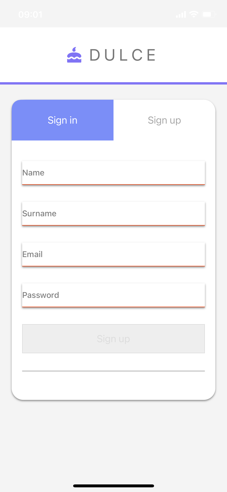
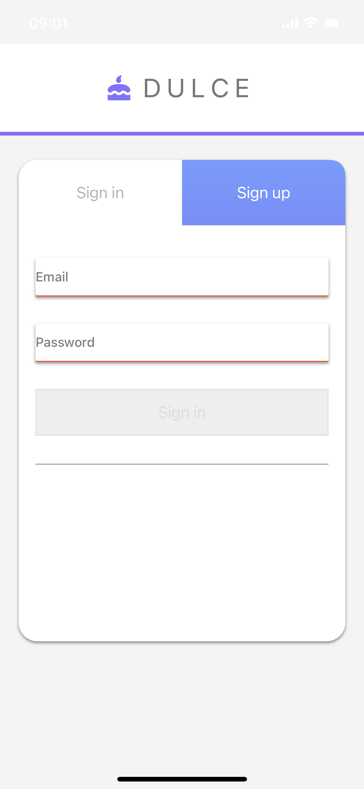

# Dulce
  

For now, simple login and sign up form with User Defaults storage. Later it will be a serious app.
  

  
  

Login and Sign up form using view controllers as UI and user defaults as a storage solution.

  

Once textField is filled and return is pressed on the keyboard, the text value from the corresponding textField will be written in memory. Next time when the application is open data saved previously will be shown.

